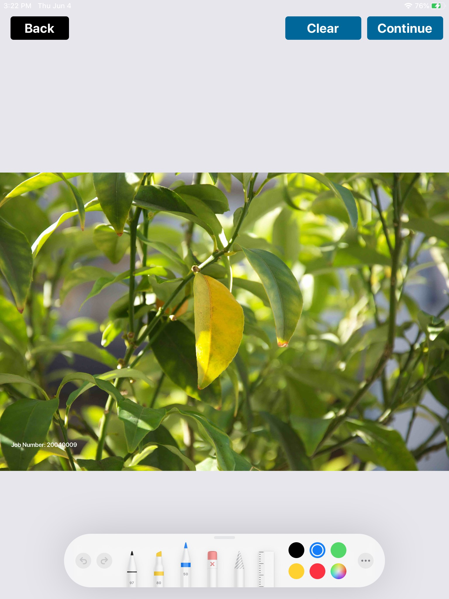

After a few weeks of the launch of iOS 13, we got a requirement from our client to change the tool kit used in our app for photo markup. The requirement was to replace the existing photo markup tool with the new inbuilt markup tool of iOS the same as the Photos app. In Photos app Markup tool looks the same as the below image.

 


We started searching for this tool and after some research, we came to know that this tool kit is launched with iOS 13 and is called Pencil Kit. PencilKit was first introduced in WWDC 2019.


## Introduction of Pencil Kit

PencilKit allows developers to easily integrate the drawing canvas view and toolkit in their applications. Pencil Kit makes it easy to incorporate hand-drawn content into iOS apps quickly and easily. Pencil Kit creates a Canvas view to draw over it using the provided tool. It provides a tool picker view to select tools for drawing.

#### PencilKit provides various tools for markup :
1. **Eraser Tool:** Using this tool users can delete a specific object or some part of the object drawn on the Canvas.
2. **Inking Tool:** These include pen, marker, and pencil for different kinds of sketches.  Users can select different colors available for the inking tool.
3. **Lasso Tool:** This tool is a selection tool for selecting a drawing area. It pops up a context menu that allows copy/paste and duplicating the selected drawing.


## Getting Started 

\t We started the implementation of the PencilKit, our goal was to use PencilKit to draw markups over a selected image from our App and save the image with the drawn markups.

### Problem Statement 
We read many tutorials and watched videos to understand the working and implementation of the Pencil kit. All the tutorials we went through were explaining how to use the PencilKit to create a drawing app, draw over a canvas, and save the drawing. But we did not find anything related to Photo markup using the Pencil kit. We did not find any way to draw over an existing image using PencilKit and save the photo with our drawings.

### Findings
We went through the implementation details of Pencil Kit, Apple Docs, and PencilKit's Classes and subclasses and properties to find a way to insert an existing image in PencilKit's canvas view and get output image as the markup drawings drawn on our inserted image. 

We also tried to look for some similar third party library but, no third party tool was found which can address our problem.

### Available Approaches
So we had two ways either to give up our tries on PencilKit and build a custom solution. We discussed with the team and decided that we will give it a try and try to build our own solution for photo mark up using PencilKit.

After we long discussions and research we finalized to approaches to implement this:
1. We will try to insert an ImageView in PencilKit's Canvas View as a SubLayer and get the output image as our input image as a Marked-up Image.
2. Create a transparent Canvas View over an ImageView. After markup, get the markup drawing image from Canvas View and draw it over our selected Image for the desired output.

On comparing both the approaches we found that the second approach is more suitable to solve our problem.


## Implementation

To start with the implementation we need to import PencilKit into our project ``#import PencilKit``. We need to create a canvas view to draw with PencilKit and an ImageView. To start with we need a ViewController with 3 properties an `ImageView`, a `CanvasView`, and an `Image`.
```
@IBOutlet weak var imgView: UIImageView!
var canvasView: PKCanvasView!
var imgForMarkup: UIImage?
```
New we will initialize the CanvasView and we will do it in *ViewDidAppear* Method :

```
self.canvasView = PKCanvasView.init(frame: self.imgView.frame)
self.canvasView.isOpaque = false        
self.view.addSubview(self.canvasView)
```

As per our requirements, we have to set the transparent `CanvasView` over an `ImageView` but `ImageView` covers the full screen of the ViewController but different Images showing every time in the `ImageView` will have different height and width every time and we need to draw markups over image only on over the vacant spaces remaining outside the Image rect. So we need to resize our `CanvasView` to our Image's visible rects. For doing this we will set the frame of our `CanvasView` respective of image : 

```
self.canvasView.frame = self.setSize()


func setSize() -> CGRect {
    let containerRatio = self.imgView.frame.size.height/self.imgView.frame.size.width
    let imageRatio = self.imgForMarkup!.size.height/self.imgForMarkup!.size.width
    if containerRatio > imageRatio {
        return self.getHeight()
    }else {
        return self.getWidth()
    }
}

func getHeight() -> CGRect {
    let containerView = self.imgView!
    let image = self.imgForMarkup!
    let ratio = containerView.frame.size.width / image.size.width
    let newHeight = ratio * image.size.height
    let size = CGSize(width: containerView.frame.width, height: newHeight)
    var yPosition = (containerView.frame.size.height - newHeight) / 2
    yPosition = (yPosition < 0 ? 0 : yPosition) + containerView.frame.origin.y
    let origin = CGPoint.init(x: 0, y: yPosition)
    return CGRect.init(origin: origin, size: size)
}

func getWidth() -> CGRect {
    let containerView = self.imgView!
    let image = self.imgForMarkup!
    let ratio = containerView.frame.size.height / image.size.height
    let newWidth = ratio * image.size.width
    let size = CGSize(width: newWidth, height: containerView.frame.height)
    let xPosition = ((containerView.frame.size.width - newWidth) / 2) + containerView.frame.origin.x
    let yPosition = containerView.frame.origin.y
    let origin = CGPoint.init(x: xPosition, y: yPosition)
    return CGRect.init(origin: origin, size: size)
}
```

After setting `CanvasView` frame we will add PencilKit's tool picker to our `CanvasView` 

```
self.canvasView?.drawing = PKDrawing()
if let window = self.view.window, let toolPicker = PKToolPicker.shared(for: window) {
    
    toolPicker.setVisible(true, forFirstResponder: self.canvasView)
    toolPicker.addObserver(self.canvasView)
    self.updateLayout(for: toolPicker)
    self.canvasView.becomeFirstResponder()
}
```

We can add a clear button to the clear all the markup we draw over the `CanvasView`. We can set IBAction of the button as :
```
@IBAction func onClear(_ sender : UIButton) {
    canvasView.drawing = PKDrawing()
    for view in shapes {
        view.removeFromSuperview()
    }
    self.shapes.removeAll()
}
```
After all above steps our Image Markup ViewController will look something like :

 

We can draw Markup over this image, but our implementation will work only with Apple Pencil.  We need to add one more property to our `CanvasView` to make it work with our Finger, considering not every user has Apple Pencil.

```
self.canvasView.allowsFingerDrawing = true
```

So now we can even draw over our image using our finger as well. So let me draw something over the image.

 

After editing we have to save our image with markup we do over the image. From `CanvasView` view get a transparent image with our drawing and we have to merge it over our existing image. For this we have written a function :


```
@IBAction func saveDrawing(_ sender : UIButton) {
    var drawing = self.canvasView.drawing.image(from: self.canvasView.bounds, scale: 0)
        if let markedupImage = self.saveImage(drawing: drawing){
        // Save the image or do whatever with the Marked up Image
        ...
        ...
    }
    ...
    self.navigationController?.popViewController(animated: true)
}

func saveImage(drawing : UIImage) -> UIImage? {
    let bottomImage = self.imgForMarkup!
    let newImage = autoreleasepool { () -> UIImage in
        UIGraphicsBeginImageContextWithOptions(self.canvasView!.frame.size, false, 0.0)
        bottomImage.draw(in: CGRect(origin: CGPoint.zero, size: self.canvasView!.frame.size))
        drawing.draw(in: CGRect(origin: CGPoint.zero, size: self.canvasView!.frame.size))
        
        let createdImage = UIGraphicsGetImageFromCurrentImageContext()
        UIGraphicsEndImageContext()
        return createdImage!
    }
    return newImage
}
```

From saveImage(drawing:) method you will get a Markedup Image and you can save it or share it as per your requirement. 


## Limitations 

However, with so many things coming out of the box, you don’t have a lot of flexibility for doing custom things. Several things I’ve encountered are:
 * It's challenging to customize the tool picker.
 * You can’t get a list of all strokes that the drawing is consisted of.
 * You get only an Image representation your drawn markups.


## Conclusion 

PencilKit is a great new framework, which provides a lot of drawing functionality out-of-the-box and It’s easy to get started and to integrate it in an app. PencilKit works seamlessly with Apple Pencil and it has high precision and low latency. With PencilKit, instead of re-inventing the wheel, you can focus on your app’s unique features. 

It has some limitations which Apple should consider and work upon that.

