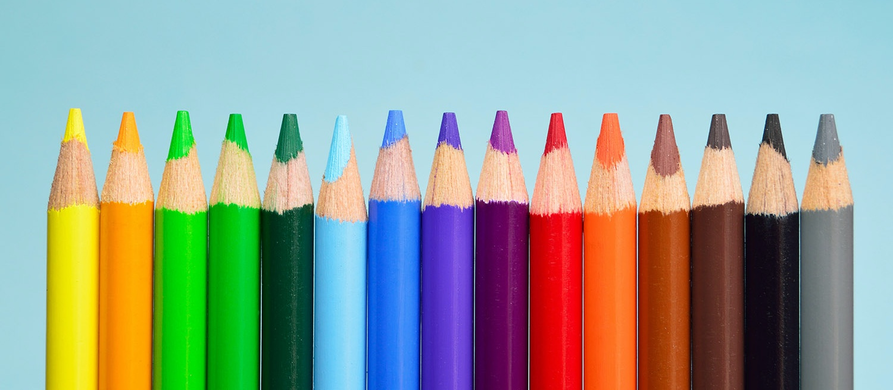
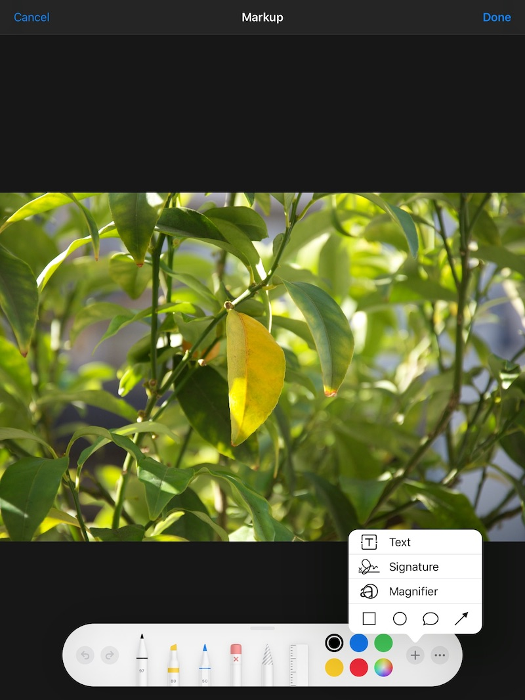
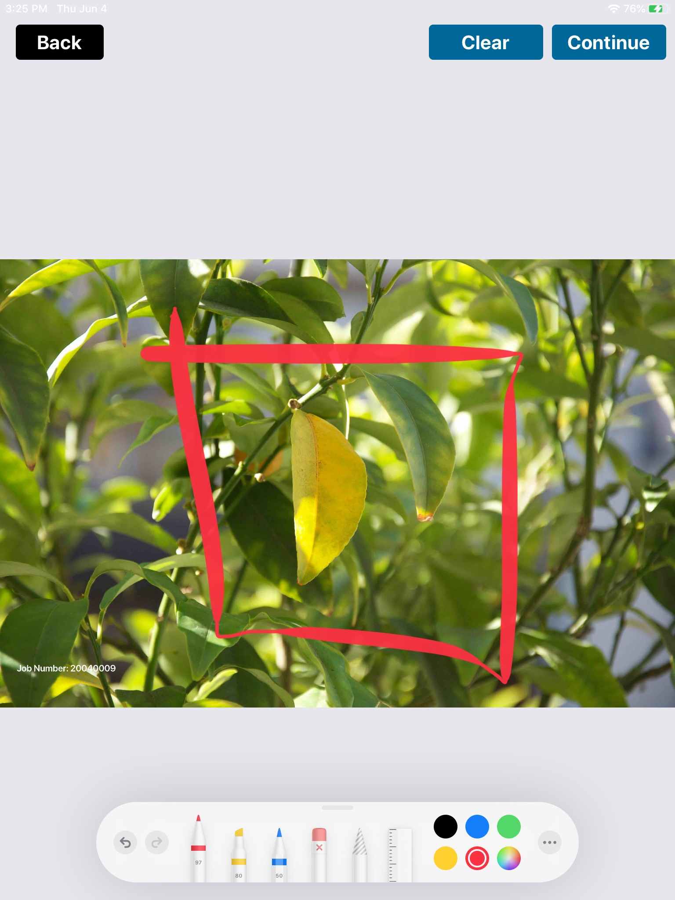

 

# Drawing Over Image With PencilKit


After a few weeks of the launch of iOS 13, we got a requirement from our client to change the existing Photo Markup Kit of our App with Apple's Inbuilt PencilKit. PencilKit's tool kit looks the same as the below image.

 


## Introduction of Pencil Kit

PencilKit allows developers to easily integrate the drawing canvas view and toolkit in their applications. Pencil Kit makes it easy to incorporate hand-drawn content into iOS apps quickly and easily. Pencil Kit creates a Canvas View to draw over it using the provided tool. It provides a tool picker view to select tools for drawing.

#### PencilKit provides various tools for markup :
1. **Eraser Tool:** Using this tool users can delete a specific object or some part of the object drawn on the Canvas.
2. **Inking Tool:** These include pen, marker, and pencil for different kinds of sketches.  Users can select different colors available for the inking tool.
3. **Lasso Tool:** This tool is a selection tool for selecting a drawing area. It pops up a context menu that allows copy/paste and duplicating the selected drawing.


## Getting Started 

We started the implementation of PencilKit, our goal was to use PencilKit to draw markups over a selected image from our App and save the image with the drawn markups.

### Problem Statement 
We read many tutorials and watched videos to understand the working and implementation of the PencilKit. All the tutorials we went through were explaining the use of PencilKit to draw over a blank canvas and save the drawing. We did not find anything related to draw over an existing image using PencilKit and save the Image with drawn markups.

### Findings
We went through the implementation details of PencilKit, Apple Docs, and PencilKit's Classes, Subclasses, and properties to find a way to insert an existing image in PencilKit's CanvasView and get the output as marked-up Image.

We also tried to look for some similar third party library but, no third party tool was found which can address our problem.

### Available Approaches
We discussed with the team and decided that we will try to build a custom solution for Image Markup using PencilKit.

After discussion and research we finalized two approaches for implementation:
1. We will try to insert an ImageView in PencilKit's CanvasView as a SubLayer, and get the output as a marked-up Image.
2. Place a transparent Canvas over an ImageView. After drawing markup, get the drawn markups as an Image from PencilKit and draw it as an overlay on our selected Image.

On comparing both the approaches we found that the second approach is more suitable and feasible for implementation.


## Implementation

To start with the implementation we need to import PencilKit into our project ``#import PencilKit``. We need to create a CanvasView to draw with PencilKit and an ImageView. So we need a ViewController with 3 properties, an `ImageView`, a `CanvasView`, and an `Image`.
```
@IBOutlet weak var imgView: UIImageView!
var canvasView: PKCanvasView!
var imgForMarkup: UIImage?
```
Now we will initialize the CanvasView and add it as subview. We will do it in *ViewDidAppear* Method :

```
self.canvasView = PKCanvasView.init(frame: self.imgView.frame)
self.canvasView.isOpaque = false        
self.view.addSubview(self.canvasView)
```

As per our requirements, we have to place a transparent `CanvasView` over an `ImageView`. Here we have to consider that, `ImageView` frame will cover the full screen of the device but different Images showing in the `ImageView` will have different height and width ratios every time. The image will appear over some part of the ImageView and the rest of the ImageView rect will remain vacant. We need to draw markups, only over the Image, and not over the vacant spaces outside the Image rect. So we need to resize our `CanvasView` to our Image's visible rects every time we load the controller and in case if device orientation is changed. For doing this we will set the frame of our `CanvasView` respective of the image : 

```
self.canvasView.frame = self.setSize()


func setSize() -> CGRect {
    let containerRatio = self.imgView.frame.size.height/self.imgView.frame.size.width
    let imageRatio = self.imgForMarkup!.size.height/self.imgForMarkup!.size.width
    if containerRatio > imageRatio {
        return self.getHeight()
    }else {
        return self.getWidth()
    }
}

func getHeight() -> CGRect {
    let containerView = self.imgView!
    let image = self.imgForMarkup!
    let ratio = containerView.frame.size.width / image.size.width
    let newHeight = ratio * image.size.height
    let size = CGSize(width: containerView.frame.width, height: newHeight)
    var yPosition = (containerView.frame.size.height - newHeight) / 2
    yPosition = (yPosition < 0 ? 0 : yPosition) + containerView.frame.origin.y
    let origin = CGPoint.init(x: 0, y: yPosition)
    return CGRect.init(origin: origin, size: size)
}

func getWidth() -> CGRect {
    let containerView = self.imgView!
    let image = self.imgForMarkup!
    let ratio = containerView.frame.size.height / image.size.height
    let newWidth = ratio * image.size.width
    let size = CGSize(width: newWidth, height: containerView.frame.height)
    let xPosition = ((containerView.frame.size.width - newWidth) / 2) + containerView.frame.origin.x
    let yPosition = containerView.frame.origin.y
    let origin = CGPoint.init(x: xPosition, y: yPosition)
    return CGRect.init(origin: origin, size: size)
}
```

After setting `CanvasView` frame we will add PencilKit's tool picker to our `CanvasView` 

```
self.canvasView?.drawing = PKDrawing()
if let window = self.view.window, let toolPicker = PKToolPicker.shared(for: window) {
    
    toolPicker.setVisible(true, forFirstResponder: self.canvasView)
    toolPicker.addObserver(self.canvasView)
    self.updateLayout(for: toolPicker)
    self.canvasView.becomeFirstResponder()
}
```

We can also add a clear button to clear all the markup we draw over the `CanvasView`. We can set  IBAction of the button as :
```
@IBAction func onClear(_ sender : UIButton) {
    canvasView.drawing = PKDrawing()
    for view in shapes {
        view.removeFromSuperview()
    }
    self.shapes.removeAll()
}
```

With this implementation, we can draw Markups, only with Apple Pencil. We need to set one more property of `CanvasView` to make it work with our Finger, considering not every user has Apple Pencil.

```
self.canvasView.allowsFingerDrawing = true
```

So now we can draw over the image using our finger as well. Now after all the above steps, our Image Markup ViewController will look like :

 

After editing we have to save the Image with the drawn Markups. For this, first, we will get an output image of our drawing from `PencilKit`. The image we get from PencilKit will be a PNG image with transparency. After that, we will draw the PNG Image as an overlay on our selected image. For this we have a function :


```
@IBAction func saveDrawing(_ sender : UIButton) {
    var drawing = self.canvasView.drawing.image(from: self.canvasView.bounds, scale: 0)
        if let markedupImage = self.saveImage(drawing: drawing){
        // Save the image or do whatever with the Marked up Image
        ...
        ...
    }
    ...
    self.navigationController?.popViewController(animated: true)
}

func saveImage(drawing : UIImage) -> UIImage? {
    let bottomImage = self.imgForMarkup!
    let newImage = autoreleasepool { () -> UIImage in
        UIGraphicsBeginImageContextWithOptions(self.canvasView!.frame.size, false, 0.0)
        bottomImage.draw(in: CGRect(origin: CGPoint.zero, size: self.canvasView!.frame.size))
        drawing.draw(in: CGRect(origin: CGPoint.zero, size: self.canvasView!.frame.size))
        
        let createdImage = UIGraphicsGetImageFromCurrentImageContext()
        UIGraphicsEndImageContext()
        return createdImage!
    }
    return newImage
}
```

From saveImage(drawing:) method we will get a Markedup Image that we can save in the device or share it as per our requirement.


## Limitations 

However, with so many things coming out of the box, you don’t have a lot of flexibility for doing custom things. Several things I’ve encountered are:
 * It's challenging to customize the tool picker.
 * You can’t get a list of all strokes that the drawing is consisted of.
 * You get only an Image representation your drawn markups.


## Conclusion 

PencilKit is a great new framework, which provides a lot of drawing functionality out-of-the-box and It’s easy to get started and to integrate it in an app. PencilKit works seamlessly with Apple Pencil and it has high precision and low latency. With PencilKit, instead of re-inventing the wheel, you can focus on your app’s unique features. 

It has some limitations which Apple should consider and work upon that.

